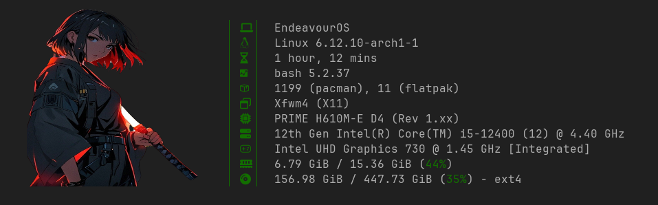

## Configuring Fastfetch

If you are new toi fastfetch, don't forget to read our [detailed guide on Fastfetch](https://itsfoss.com/fine-control-fastfetch/).

In this repository, you can find some ready to use configuration file for Fastfetch.

### What to do

Download the contents of this repository.

Now, create a directory (if not already there) called `~/.config/fastfetch`.

```
mkdir -p ~/.config/fastfetch
```

Copy the `assets` directory and the required config file to the `~/.config/fastfetch` directory. Let's say use the `simple_1.jsonc` as my config. So, inside the repo folder, 

```
cp -r assets/ ~/.config/fastfetch
cp sample_1.jsonc ~/.config/fastfetch
```

Now, either rename the config file as `config.jsonc`:

```
cd ~/.config/fastfetch
mv sample_1.jsonc config.jsonc
```

Or, launch fastfetch with new config:

```
fastfetch --config ~/.config/fastfetch/sample_1.jsonc
```

> Note: The image is not supported by all terminals. Kitty, Ghostty, etc. supports the image.

## Examples

[sample_1.jsonc](./sample_1.jsonc)



[sample_2.jsonc](./sample_2.jsonc)


[Ordered-sections.jsonc](./ordered-sections.jsonc)


The above configuration works best in wide terminal (100x25).


