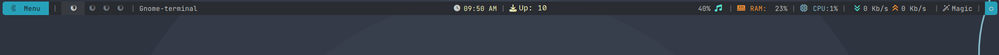

## Configure Polybar



Download all the files in this repo, except the git specific ones.

Now, paste these files in the directory, `~/.config/polybar`.

If that directory is not already present, use the command below to create it:

```
mkdir -p ~/.config/polybar
```

The files in these repo are:

1. `config.ini`: Main Polybar config
2. `mintupdates.sh`: A shell script to get the number of updates available to the Mint system.
3. `pacupdates.sh`: A shell script to get the number of updates available in an Arch Linux based system.
4. `logout.sh` : A one line script to call `xfce-session-logout`.
5. `polybar.sh`: A script that allows to restart polybar in place if any config change.
6. `rofi.sh`: A one liner script that calls rofi menu with icons.

If you are on an Arch Linux system, use the `pacupdates.sh` and ignore the `mintupdates` file. Same for other.

Once everything is pasted, add `polybar` to your system autostart application list. This process varies on different desktops.

Now, reboot your system and log back in to get the polybar.

> If any module is not working or not showing, you can remove them by removing them from the `modules-left`, `modules-center`, or `modules-right` section in `config.ini` file.
> Expected items that won't work in all situation is `pacupdate` and `temperature` module, because that need user specfic entries.
> So, it is disabled by default in the config. You can enable it by adding `pacupdate` or `temperature` in either `modules-left`, `modules-centre`, or `modules-right` section in `config.ini`

If you are using Xfce, first disable the tray module in Polybar and then enable tray module in Xfce panel. Otherwise, Spotify will not play in the background.

## Monitor Name

You can find the monitor name using the Xrandr command:

```
xrandr
```

This will print a huge list of details about connected displays. Locate the name. For example:

- HDMI-1
- Virtual1 (for Virtual Machines)
- etc.

Paste this value in `[bar/mybar]` section as `monitor` value.

## Using the Updates file

If you are on Linux Mint, you should be using the `mintupdates.sh` file. This is because, we are using the `mintupdate-cli` command to get package update number.

Download this file and paste it inside the `~/.config/polybar/` folder.

Now, open the `config.ini` file in a text editor and go to the `pacupdate` module. You can use the search feature in the editor.

Once located,change the value in `exec` field to point to the `mintupdates.sh` file.

For Arch Linux, the process is same, but use the `pacupdates.sh` file instead of the `mintupdates.sh` file.

For example, if I am using Linux mint, my `exec` line will be:

```
exec = /home/$USER/.config/polybar/mintupdates.sh
```

If I use Arch Linux, it will be:

```
exec = /home/$USER/.config/polybar/pacupdates.sh
```

### Change the Click-left entry:

Here, the click-left is option is used to send the list of available packages as a system notification. So,

**For Linux Mint**

```
click-left = notify-send "Updates:" "$(mintupdate-cli list)"
```

The value `mintupdate-cli list` will list all packages, that has an update and will send as a notification using `notify-send`.

**For Arch Linux**

```
click-left = notify-send "Updates:" "$(checkupdates)"
```

Here, `checkupdates` is an Arch Linux contrib command, that will list packages that has update without actually updating the system.

## Temperature File

It shows temperature in the middle section. If you don't want to show, remove the `temperature` entry from the `modules-center` in `config.ini`.

For those who don't want to dig deeper, this is the best way... Just avoid temperature module from the bar and use resource monitors to look for temperature.

Else, you need to specify the temperature file location in the `hwmon-path`.

This can be found in places under `/sys/devices` or distro specific location.

