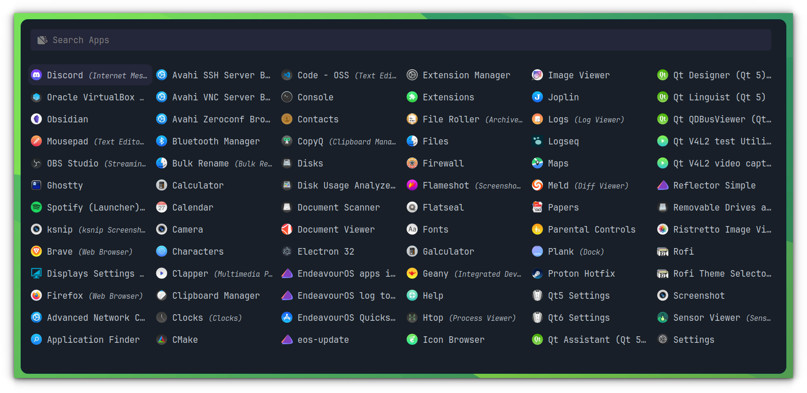
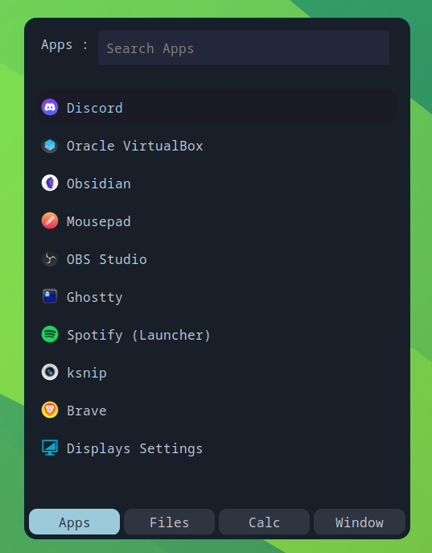
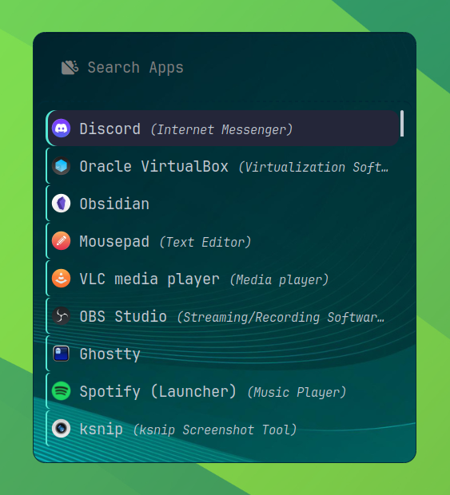

# Rofi Configuration Files

In the repository, you can find ready to use configuration files for Rofi.Respective screenshots are also given for you to choose. 

## How to use the configuration

If the configuration you choose does not have an image background, then simply download that configuration file and place it in `~/.config/rofi` directory.

If there is an image background in any part of rofi (check the respective screenshots), then download the config file and the assets folder.

Place the `assets` folder and the configuration file inside the `~/.config/rofi/` directory.

For ease of use, better to paste both `assets` and the config file to the rofi directory, so that you can add your favorite image to this directory and modify the config later.

Once places the files, the command to invoke Rofi with the new config file is:

```
rofi -show drun -config ~/.config/rofi/<name of the configuration file>
```

For example, 

```
rofi -show drun -config ~/.config/rofi/wide-multicolumn.rasi
```

## Config Files

Wide Multi-column



[Wide Multi-column config file](./wide-multicolumn.rasi)

Combi-mode 1



This needs the [rofi-calc](https://github.com/svenstaro/rofi-calc) module to be installed.

[Combi-mode 1 config file](./combi-mode-1.rasi)

Simple BG 1



You can check for additional image backgroun files in the assets folder.

[Simple-bg-1 config file](./simple-bg-1.rasi)

Todo
- [ ] Add more rofi config files